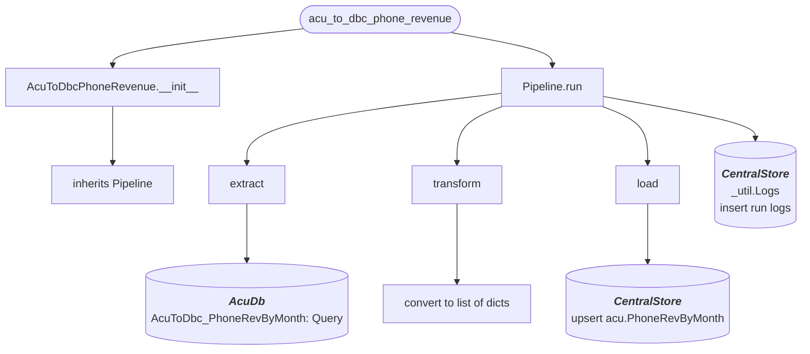

# acu_to_dbc_phone_revenue
Gets all Orders created/modified within the last day having an *OrderType* of ***PH*** or ***BF*** and a non null phone number and loads to acu.PhoneRevByMonth in db_CentralStore

## Schedule
- ### :00, :30

## Execution Behavior
Executes single pipeline, **AcuToDbcPhoneRevenue**

## Pipelines

### AcuToDbcPhoneRevenue
#### `AcuToDbcPhoneRevenue` Pipeline Documentation — [pipelines/acu_to_dbc_phone_revenue.py](../../pipelines/acu_to_dbc_phone_revenue.py)

## Queries
### AcumaticaDb
 - #### [AcuToDbc_Quotes.sql](../../sql/queries/AcumaticaDb/AcuToDbc_Quotes.sql)