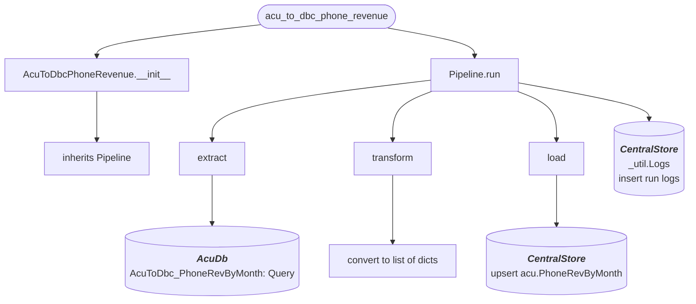

```mermaid
%%{init: {"flowchart": {"wrappingWidth": 400}}}%%
flowchart TD
    A([acu_to_dbc_phone_revenue]) --> B[AcuToDbcPhoneRevenue.__init__]
    B --> B1[inherits Pipeline]

    A--> RUN[Pipeline.run]

    RUN --> EX[extract]
    EX --> D1[(
        <b><i>AcuDb</i></b>
        AcuToDbc_PhoneRevByMonth: Query)]

    RUN --> TR[transform]
    TR --> T1[convert to list of dicts]

    RUN --> LD[load]
    LD --> L1[(
        <b><i>CentralStore</i></b>
        upsert acu.PhoneRevByMonth
    )]

    RUN --> LOGS[(
        <b><i>CentralStore</i></b>
        _util.Logs<br/>insert run logs
    )]
```
